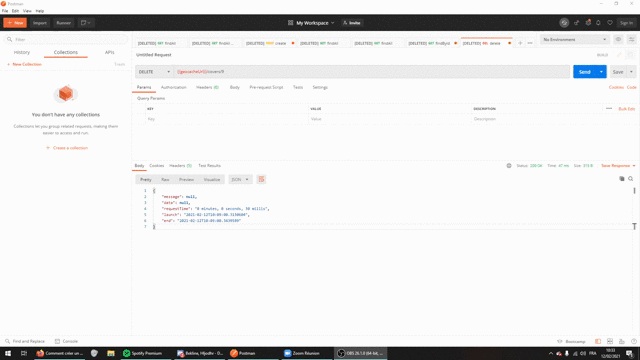

# ctp-journal
## Installation de la solution
#### Postman
Pour l’installation de la solution, il faut dans un premier temps importer la collection Postman 
dans Postman. Pour ce faire, il suffit de cliquer sur le “IMPORT”, puis cliquez sur la nouvelle 
fenêtre et choisissez le fichier JSON. La collection est maintenant importée.

(Disponible ici : ```/src/main/resources/hackathon.postman-final_collection.json```)


Cette collection va permettre de faire des appels à nos différents services et de récupérer les 
informations voulues.
Dedans, on pourra remarquer deux dossiers un mongodb et un mysql pour chaque mode de fonctionnement.


#### Mysql
Il faut ensuite importer la base de données dont le script est disponible dans ```/src/main/resources/bdd/hackathon_v2.sql```, nous avons utilisé l’utilisateur root et le mot de passe root.
Si la bdd de données possède un nom d'utilisateur et/ou mot de passe particulier, il est possible
de les modifier dans le fichier ```/src/main/resources/application.properties``` pour mysql

#### Lancement du projet via IntelliJ
Pour l’installation de la solution, il faut `simplement` faire à la racine du projet :
````mvn clean install````
Puis il suffit de lancer la configuration `CtpJournalApplication`

Maintenant, il est possible de tester l'application via Postman
#### Lancement via terminal
````shell
java -jar target/*.jar
````
